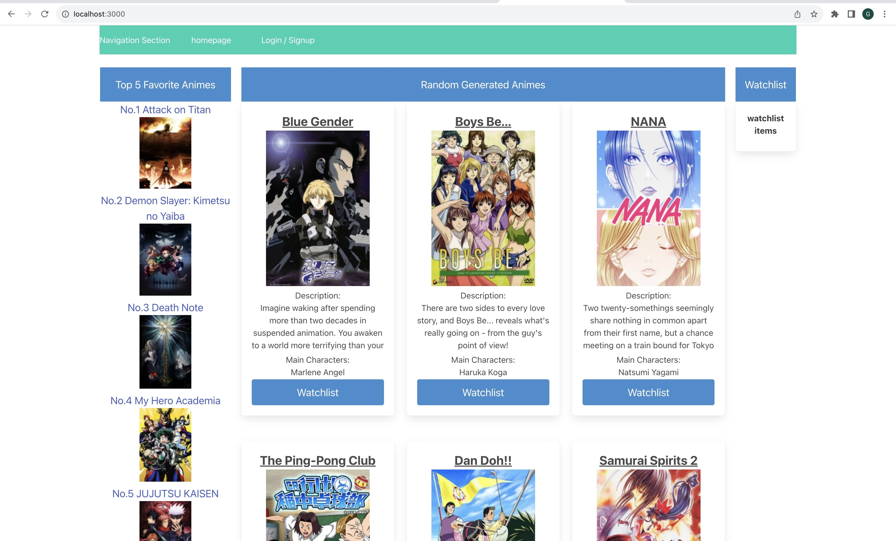

# Anime-Fusion
# Description
We wanted to make a randomized page of anime for suggestions for our logged in user to watch. The main goal was to allow the user to get a brief synopsis of that anime and decide if they wanted to try it out. You can reload the page and get a new set of anime with our reload button if you don't like the six you got. We also wanted the user to be able to save animes to their watchlist and be able to access their watchlist when they are logged in.

Hear is a Photo of the website.

***
* link to website and github

    
***
# Technologies Used
1. Handlebars
2. CSS
3. javascript
4. Bulma 
5. api
